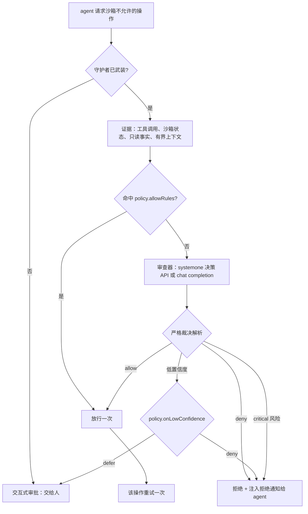

# dsh-auto-review-jev

简体中文 | [English](README_EN.md)

<p align="center">
  <a href="https://github.com/xlennart/dsh-auto-review-jev/releases"></a>
  <a href="LICENSE"></a>
  <a href="https://github.com/topics/dsh-plugin"></a>
  <a href="https://github.com/topics/dsh-plugin-verify"></a>
  <a href="https://github.com/topics/deepseek-harness"></a>
  <a href="#system-one-决策-api-审查器"></a>
</p>

<p align="center">
  <strong>DeepSeek Harness 的审批守护者：权限请求先由 reviewer 模型裁决，再决定要不要打扰你。</strong>
</p>

<p align="center">
  <a href="#安装">安装</a> ·
  <a href="#快速开始">快速开始</a> ·
  <a href="#工作方式">工作方式</a> ·
  <a href="#配置">配置</a> ·
  <a href="#system-one-决策-api-审查器">System One</a> ·
  <a href="#免审白名单与低置信度">策略</a> ·
  <a href="#信任边界">信任边界</a> ·
  <a href="#验证">验证</a>
</p>

> [!NOTE]
> 本项目 fork 自 [`gbthui/dsh-auto-review`](https://github.com/gbthui/dsh-auto-review)（Apache-2.0）。审查接缝、证据流水线、熔断器与审计落盘是上游工作；本 fork 增加 **System One 决策 API 协议**、**`onLowConfidence` 策略**、**`allowRules` 免审白名单**，以及两者的设置页编辑器。

## 为什么有这个 fork

| | 上游 `dsh-auto-review` | 本 fork |
| --- | --- | --- |
| 审查协议 | chat completion（`/chat/completions`） | **chat completion 或 System One 决策 API**（`POST {baseURL}/systemone`，一次调用并行问两个 choice 问题） |
| 后端 | 任意 OpenAI 兼容端点 | 另加 **TypeSafe Jev**、**硅基流动 `systemone`**、**自部署 Laya**（回环地址免 key） |
| 审查器犹豫时 | 一律拒绝 | **`policy.onLowConfidence: deny \| defer`**，defer 把请求交回人工，而不是静默拒绝 |
| 重复请求 | 每次都问审查器 | **`policy.allowRules`** 按「工具 + 操作前缀」精确预批，越权放行由 `policy.allowDangerFullAccessRules` 单独把关 |
| 设置页 | 只有 reviewer | reviewer **与** policy（置信度阈值、低置信度动作、免审白名单） |

## 安装

插件装在 **web** profile，三种来源任选：

```bash
# 1) 发行包（预构建，免构建步骤，也不需要放行构建脚本）
npx @deepseek-ai/dsh plugin --profile web add \
  https://github.com/xlennart/dsh-auto-review-jev/releases/download/v0.2.0-jev.0/dsh-auto-review-jev-0.2.0-jev.0.tgz

# 2) 直接从 git 安装
npx @deepseek-ai/dsh plugin --profile web add https://github.com/xlennart/dsh-auto-review-jev.git

# 3) 本地目录（开发用）
npx @deepseek-ai/dsh plugin --profile web add /path/to/dsh-auto-review-jev
```

bundle 在 **profile 进程启动时**读取，所以装完要重启 profile（桌面端：托盘退出后重新启动；CLI：停掉再执行 `npx @deepseek-ai/dsh web`）——正在运行的宿主不会自动加载新装或重新构建的插件。

在会话里确认：

```text
/auto-review status
```

它会输出守护者是否已武装、由哪个端点/模型裁决、审计文件在哪里。

## 快速开始

插件默认启用；未配置 reviewer 时跟随**当前会话模型**，无需任何设置。若要指定 System One 后端：

```yaml
# ~/.dsh/settings.yaml
dsh-auto-review:
  reviewer:
    protocol: systemone              # chat（默认）| systemone
    baseURL: https://api.typesafe.ai/v1
    model: jev-latest
    apiKeyFile: ~/.dsh/reviewer.env  # KEY=VALUE 文件；也支持 apiKey / apiKeyEnv
    systemone:
      confidenceThreshold: 0.8       # 决策答案低于此值即不予采信
  policy:
    onLowConfidence: defer           # deny（默认）| defer 交人工
```

Web UI 的 **设置 → dsh-auto-review** 里同样可以改。

## 工作方式



* **审查器只替代审批提示**。插件不改沙箱配置、也不会自行放宽沙箱：它只回答宿主已经抛出的请求。
* **critical 风险一律拒绝**，不受 decision 答案影响。
* **审查器出错时失败关闭**（`policy.denyOnReviewerError: true`）。
* **熔断器**能拦住反复试探被拒操作的 agent。
* 拒绝会以通知形式注入会话，来源使用生产方自有 kind（`plugin:dsh-auto-review`），因此 transcript 始终满足 v4 会话格式。

## 配置

设置段：`dsh-auto-review`。完整参考见 [`docs/configuration.md`](docs/configuration.md)。

### reviewer

| 键 | 默认值 | 说明 |
| --- | --- | --- |
| `protocol` | `chat` | `chat` = OpenAI 兼容补全，`systemone` = System One 决策 API |
| `baseURL` | `''` | 空 + `chat` = 当前会话模型；空 + `systemone` = 硅基流动 |
| `model` | `''` | 空 + `systemone` = `Kev-4b`（硅基流动暂定默认） |
| `apiKey` / `apiKeyEnv` / `apiKeyFile` | `''` | 三选一；回环端点不需要 |
| `timeoutMs` | `24000` | 单次审查调用超时 |
| `thinking` | `default` | 对不接受 thinking 的后端设 `off` |
| `systemone.confidenceThreshold` | `0.6` | 低于此值的决策答案不予采信（0.5–1） |
| `factFinding.enabled` / `maxRounds` / `maxFacts` | `true` / `2` / `3` | 审查器可调用的只读事实工具 |
| `factFinding.content.enabled` / `maxBytes` | `false` / `4096` | 是否允许把文件**内容**附进请求 |

### policy

| 键 | 默认值 | 说明 |
| --- | --- | --- |
| `enabled` | `true` | 总开关（`/auto-review on │ off`） |
| `tools` | `[]` | 限定守护者审查哪些工具 |
| `allowRules` | `[]` | 免审白名单：`{ tool, operations[], escalationTarget }` |
| `allowDangerFullAccessRules` | `false` | 必须显式打开，规则才允许授予 `danger-full-access` |
| `onLowConfidence` | `deny` | `deny`（失败关闭）或 `defer`（交人工） |
| `denyOnReviewerError` | `true` | 审查器崩溃/超时 ⇒ 拒绝 |
| `context.enabled` / `maxMessages` / `maxChars` | `true` / `10` / `6000` | 交给审查器的有界会话上下文 |
| `breaker.consecutiveDenyLimit` / `windowDenyLimit` | `3` / `10` | 连续拒绝达阈值即熔断 |
| `audit.enabled` / `path` / `includeToolInput` | `true` / `~/.dsh/auto-review-audit.jsonl` / `false` | 每次裁决一行 JSON |

## System One 决策 API 审查器

`protocol: systemone` 把一次审查变成**一次**决策 API 调用：

```http
POST {baseURL}/systemone
{ "model": "<model>", "state": { "policy": "...", "request": "..." },
  "questions": { "decision": {...}, "risk": {...} } }
```

两个 choice 问题（`decision`、`risk`）并行提出，返回的结构化答案被确定性地合成为与 chat 路径完全相同的裁决 JSON，并走**同一套严格解析**（critical 风险拒绝、未知选项判为格式错误、低置信度交由 `policy.onLowConfidence`）。置信度按 `|p(allow) − 0.5| × 2` 计算，所以 `p(allow)=0.500` 得到置信度 `0.000`——这是「无法判断」，而不是悄悄放行。

| 后端 | `baseURL` | `model` | 密钥 |
| --- | --- | --- | --- |
| **TypeSafe Jev**（推荐） | `https://api.typesafe.ai/v1` | `jev-latest` | TypeSafe key（审计里记录裁决模型，如 `jev-1.13.0`） |
| **硅基流动** | *（空）* → `https://api.siliconflow.cn/v1` | *（空）* → `Kev-4b` | 硅基流动 key |
| **自部署 Laya** | 你的 Laya 端点 | 你的模型 | 回环地址免 key |

来自真实使用的标定结论：面对 escalation 类请求，Jev 常常刻意保持不表态（置信度接近 `0.000`）。此时 `onLowConfidence: deny` 等于「不批」，`defer` 等于「问人」——想少被打扰就提高 `allowRules` 覆盖率或下调 `confidenceThreshold`。

## 免审白名单与低置信度

与其让审查器揣摩你的习惯，不如把**窄而重复**的形态显式预批：

```yaml
dsh-auto-review:
  policy:
    onLowConfidence: defer
    allowRules:
      - tool: write                       # 工具名精确匹配
        operations: ['C:\work\notes\']    # 操作前缀（路径/命令）
      - tool: bash
        operations: ['git status', 'git log']
        escalationTarget: workspace-write # "" | workspace-write | danger-full-access
    allowDangerFullAccessRules: false     # 无沙箱放行保持默认关闭
```

命中规则会**跳过审查器**并直接放行一次，所以规则必须保守：escalation 规则至少钉住一个操作前缀；未打开 `allowDangerFullAccessRules` 时，配置校验会直接拒绝 `escalationTarget: danger-full-access`。

`onLowConfidence` 决定「不可采信的审查结论」意味着什么：

| 取值 | 行为 |
| --- | --- |
| `deny`（默认） | 失败关闭——审查器不表态即拒绝，并告知 agent 原因 |
| `defer` | 该请求落回**人工**审批；审计行记 `source=reviewer-low-confidence` |

## 信任边界

* **外发内容**：待批工具调用、沙箱状态、审查器主动索取的只读事实，以及一段有界上下文（默认 10 条消息 / 6000 字符；文件**内容**默认关闭）。没有别的——不导出环境变量、不发送完整 transcript、不含凭据。
* **密钥不外流**：API key 来自 `apiKey`、`apiKeyEnv` 或 `KEY=VALUE` 文件，并在审查请求、审计行与 trace 中被抹除。
* **回环特殊处理**：自部署端点在 `127.0.0.1`/`localhost`/`[::1]` 上可免 key；其他地址缺 key 时拒绝启动。
* **本地产物**：`~/.dsh/auto-review-audit.jsonl`（每次裁决一行，`includeToolInput` 默认关闭）与 `~/.dsh/auto-review-trace.jsonl`（每次请求为何如此处理：谁裁决、端点、模型、置信度）。都是纯本地文件，随时可删。
* **插件无法给自己授权**：它只回答宿主已抛出的请求，且从不修改沙箱配置。

## 验证

```bash
npm run build      # tsc → lib/
npm test           # 对构建产物跑零依赖的冒烟套件
npm run test:systemone   # 针对本地 mock System One 决策 API 的集成测试
```

`npm test` 包含五个冒烟套件（模块与导出、答案裁决、消息来源准入、trace 落盘、前端契约）。`test:systemone` 会拉起一个本地 mock 决策 API，断言整条链路：请求形状、密钥处理、置信度到策略的映射，以及解析器的失败关闭行为。它直接引用 TypeScript 源码，因此需要能解析到 harness 包（在 checkout 或已装 harness 的 profile 内运行）。

## 排查

| 现象 | 原因 / 处理 |
| --- | --- |
| `dsh plugin add` 或重新构建后没有任何变化 | bundle 在进程启动时读取——重启 profile。 |
| `/auto-review status` 提示没有 settings provider | 在 profile patch 里设 `dsh-auto-review.enabled`，或用 Web 设置页。 |
| 安装报 `ERESOLVE` | 改用发行包（预构建）而非 git spec，或加 `--legacy-peer-deps`。 |
| 所有请求都落回人工 | 审查器结论低于 `confidenceThreshold` 且 `policy.onLowConfidence: defer`。提高 `allowRules` 覆盖率，或改为 `deny`。 |
| 审查器一律拒绝 | 看 `audit.path`——每行带 `p(allow)`、`confidence`、`risk` 以及裁决模型。 |
| 拒绝后会话损坏 | 0.2.0-jev.0 起不应再出现；注入使用生产方自有 source kind。若见到 `format v4 message requires a producer-owned source kind`，说明该构建早于修复。 |

## 兼容性

DeepSeek Harness `0.2.0-rc.x`（声明为 `engines.dsh: >=0.2.0-0 <0.3.0`），Node.js ≥ 22。官方 `@deepseek-ai/*` 包由 profile 在运行时提供，因此**刻意不声明为依赖**（避免 profile 内出现重复运行时）。

## 文档

* [`docs/configuration.md`](docs/configuration.md) —— 全部设置项与默认值
* [`docs/deployment.md`](docs/deployment.md) —— 多 profile、文件/registry 安装、手工接入
* [`docs/terminology.yaml`](docs/terminology.yaml) —— 文档用词表
* [`CHANGELOG.md`](CHANGELOG.md) —— 本 fork 相对上游的变更

## 许可证

Apache-2.0。上游：[`gbthui/dsh-auto-review`](https://github.com/gbthui/dsh-auto-review)（Apache-2.0），本 fork 建立在其审查接缝、证据流水线、熔断器与审计落盘之上。
