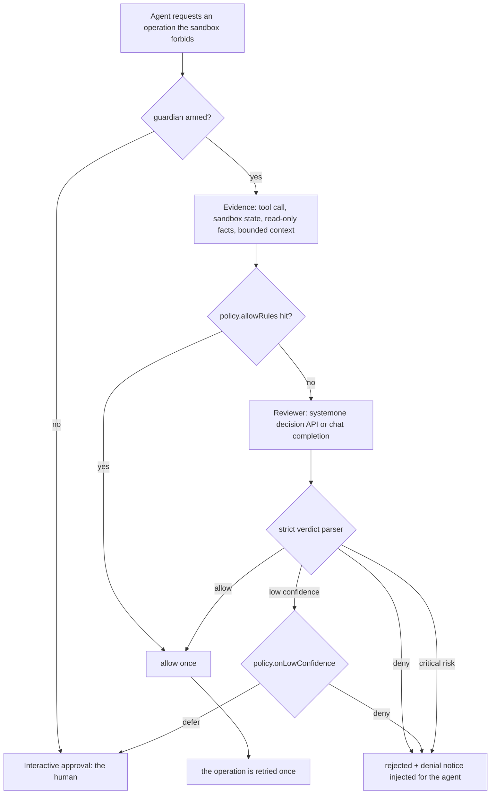

# dsh-auto-review-jev

[简体中文](README.md) | English

<p align="center">
  <a href="https://github.com/xlennart/dsh-auto-review-jev/releases"></a>
  <a href="LICENSE"></a>
  <a href="https://github.com/topics/dsh-plugin"></a>
  <a href="https://github.com/topics/dsh-plugin-verify"></a>
  <a href="https://github.com/topics/deepseek-harness"></a>
  <a href="#system-one-decision-api-reviewer"></a>
</p>

<p align="center">
  <strong>A DeepSeek Harness approval guardian: permission requests are decided by a reviewer model before they ever reach you.</strong>
</p>

<p align="center">
  <a href="#install">Install</a> ·
  <a href="#quick-start">Quick start</a> ·
  <a href="#how-it-works">How it works</a> ·
  <a href="#configuration">Configuration</a> ·
  <a href="#system-one-decision-api-reviewer">System One</a> ·
  <a href="#allow-rules-and-low-confidence">Policy</a> ·
  <a href="#trust-boundary">Trust boundary</a> ·
  <a href="#verification">Verification</a>
</p>

> [!NOTE]
> This is a fork of [`gbthui/dsh-auto-review`](https://github.com/gbthui/dsh-auto-review) (Apache-2.0). The reviewer seam, evidence pipeline, circuit breaker and audit sink are upstream work; this fork adds the **System One decision-API protocol**, the **`onLowConfidence` policy**, the **`allowRules` pre-approval whitelist** and a settings-page editor for both.

## Why this fork

| | upstream `dsh-auto-review` | this fork |
| --- | --- | --- |
| Reviewer protocol | chat completion (`/chat/completions`) | **chat completion or System One decision API** (`POST {baseURL}/systemone`, one call, two parallel choice questions) |
| Backends | any OpenAI-compatible endpoint | + **TypeSafe Jev**, **SiliconFlow `systemone`**, **self-hosted Laya** (loopback needs no key) |
| Uncertain reviewer | deny | **`policy.onLowConfidence: deny \| defer`** — defer hands the ask to the human instead of a silent deny |
| Repeated asks | every ask goes to the reviewer | **`policy.allowRules`** pre-approves exact tool + operation prefixes, with `policy.allowDangerFullAccessRules` gating unsandboxed grants |
| Settings page | reviewer fields | reviewer **and** policy (confidence threshold, low-confidence action, allow rules) |

## Install

The plugin lives in the **web** profile. Pick one source:

```bash
# 1) release tarball (prebuilt, no build step, no approval to run build scripts)
npx @deepseek-ai/dsh plugin --profile web add \
  https://github.com/xlennart/dsh-auto-review-jev/releases/download/v0.2.0-jev.0/dsh-auto-review-jev-0.2.0-jev.0.tgz

# 2) straight from git
npx @deepseek-ai/dsh plugin --profile web add https://github.com/xlennart/dsh-auto-review-jev.git

# 3) from a local checkout (development)
npx @deepseek-ai/dsh plugin --profile web add /path/to/dsh-auto-review-jev
```

A bundle is loaded **when the profile process starts**, so restart the profile (for the desktop app: quit from the tray and start it again; for the CLI: stop and re-run `npx @deepseek-ai/dsh web`) — a running host will not pick up a newly installed or newly rebuilt plugin.

Verify inside a session:

```text
/auto-review status
```

It prints whether the guardian is armed, which endpoint/model answers, and where the audit file is.

## Quick start

The plugin is enabled by default and, with no reviewer configured, uses the **current session model** — nothing to set up. To point it at a dedicated System One backend:

```yaml
# ~/.dsh/settings.yaml
dsh-auto-review:
  reviewer:
    protocol: systemone              # chat (default) | systemone
    baseURL: https://api.typesafe.ai/v1
    model: jev-latest
    apiKeyFile: ~/.dsh/reviewer.env  # KEY=VALUE file; apiKey / apiKeyEnv also work
    systemone:
      confidenceThreshold: 0.8       # decision answers below this are not trusted
  policy:
    onLowConfidence: defer           # deny (default) | defer to the human
```

Everything is also editable in **Settings → dsh-auto-review** in the Web UI.

## How it works



* **The reviewer only substitutes for the approval prompt.** The plugin never changes sandbox configuration and never widens a sandbox on its own: it answers an ask the harness has already raised.
* **Critical risk always denies**, whatever the decision answer said.
* **Reviewer errors fail closed** (`policy.denyOnReviewerError: true`).
* A **circuit breaker** stops an agent that keeps proposing variants of a denied action.
* Denials are injected into the conversation as a notice with a producer-owned source kind (`plugin:dsh-auto-review`), so the transcript stays valid for the v4 session format.

## Configuration

Settings segment: `dsh-auto-review`. Full reference: [`docs/configuration.md`](docs/configuration.md).

### Reviewer

| Key | Default | Notes |
| --- | --- | --- |
| `protocol` | `chat` | `chat` = OpenAI-compatible completion, `systemone` = System One decision API |
| `baseURL` | `''` | empty + `chat` = current session model; empty + `systemone` = SiliconFlow |
| `model` | `''` | empty + `systemone` = `Kev-4b` (SiliconFlow provisional default) |
| `apiKey` / `apiKeyEnv` / `apiKeyFile` | `''` | any one of the three; loopback endpoints need none |
| `timeoutMs` | `24000` | per reviewer call |
| `thinking` | `default` | `off` for backends that reject thinking |
| `systemone.confidenceThreshold` | `0.6` | decision answers below this are not trusted (0.5–1) |
| `factFinding.enabled` / `maxRounds` / `maxFacts` | `true` / `2` / `3` | read-only fact tools the reviewer may call |
| `factFinding.content.enabled` / `maxBytes` | `false` / `4096` | whether file **content** may be attached to the ask |

### Policy

| Key | Default | Notes |
| --- | --- | --- |
| `enabled` | `true` | master switch (`/auto-review on │ off`) |
| `tools` | `[]` | restrict which tools the guardian reviews |
| `allowRules` | `[]` | pre-approval whitelist: `{ tool, operations[], escalationTarget }` |
| `allowDangerFullAccessRules` | `false` | must be `true` before a rule may grant `danger-full-access` |
| `onLowConfidence` | `deny` | `deny` (fail closed) or `defer` (ask the human) |
| `denyOnReviewerError` | `true` | reviewer crash/timeout ⇒ deny |
| `context.enabled` / `maxMessages` / `maxChars` | `true` / `10` / `6000` | bounded conversation context for the reviewer |
| `breaker.consecutiveDenyLimit` / `windowDenyLimit` | `3` / `10` | trip after repeated denials |
| `audit.enabled` / `path` / `includeToolInput` | `true` / `~/.dsh/auto-review-audit.jsonl` / `false` | one JSON line per decision |

## System One decision API reviewer

`protocol: systemone` turns a review into **one** decision-API call:

```http
POST {baseURL}/systemone
{ "model": "<model>", "state": { "policy": "...", "request": "..." },
  "questions": { "decision": {...}, "risk": {...} } }
```

Two choice questions (`decision`, `risk`) are asked in parallel; the typed answers are synthesised into the very same verdict JSON the chat path produces and go through the **same strict parser** (critical risk denies, unknown choices are malformed, low confidence is subject to `policy.onLowConfidence`). Confidence is `|p(allow) − 0.5| × 2`, so an answer of `p(allow)=0.500` is confidence `0.000` — uninformative, not a quiet allow.

| Backend | `baseURL` | `model` | Key |
| --- | --- | --- | --- |
| **TypeSafe Jev** (recommended) | `https://api.typesafe.ai/v1` | `jev-latest` | TypeSafe key (Jev answers are produced by a decision model, `jev-1.13.0` in the audit trail) |
| **SiliconFlow** | *(empty)* → `https://api.siliconflow.cn/v1` | *(empty)* → `Kev-4b` | SiliconFlow key |
| **Self-hosted Laya** | your Laya endpoint | your model | none on loopback |

Calibration note from real use: on escalation-style asks Jev is often deliberately uninformative (confidence near `0.000`). With `onLowConfidence: deny` that means "no", with `defer` it means "ask the human" — raise `allowRules` coverage or lower `confidenceThreshold` if you want fewer interruptions.

## Allow rules and low confidence

Pre-approve a narrow, repeatable shape instead of teaching the reviewer your habits:

```yaml
dsh-auto-review:
  policy:
    onLowConfidence: defer
    allowRules:
      - tool: write                       # exact tool name
        operations: ['C:\work\notes\']    # operation prefixes (path/command)
      - tool: bash
        operations: ['git status', 'git log']
        escalationTarget: workspace-write # "" | workspace-write | danger-full-access
    allowDangerFullAccessRules: false     # unsandboxed grants stay opt-in
```

A rule hit **skips the reviewer** and allows once, so rules are deliberately conservative: an escalation rule must pin at least one operation prefix, and `escalationTarget: danger-full-access` is refused by config validation unless `allowDangerFullAccessRules` is on.

`onLowConfidence` decides what an *untrusted* reviewer answer means:

| Value | Behaviour |
| --- | --- |
| `deny` (default) | fail closed — an uninformative reviewer denies, the agent is told why |
| `defer` | the ask falls through to **human** approval; the audit line records `source=reviewer-low-confidence` |

## Trust boundary

* **What leaves the machine:** the pending tool call, the sandbox state, the read-only facts the reviewer asked for, and a bounded slice of conversation context (10 messages / 6000 chars by default; file *contents* are off by default). Nothing else — no environment dump, no full transcript, no credentials.
* **Secrets never travel:** API keys are read from `apiKey`, `apiKeyEnv` or a `KEY=VALUE` file and are redacted out of reviewer requests, audit lines and traces.
* **Loopback is special:** a self-hosted endpoint on `127.0.0.1`/`localhost`/`[::1]` may run without a key; anything else refuses to start unkeyed.
* **Local artifacts:** `~/.dsh/auto-review-audit.jsonl` (one decision per line, `includeToolInput` off by default) and `~/.dsh/auto-review-trace.jsonl` (per-ask why: who answered, endpoint, model, confidence). Both are plain local files; delete them freely.
* **The plugin cannot grant itself anything.** It only answers asks the harness already raised, and it never edits sandbox configuration.

## Verification

```bash
npm run build      # tsc → lib/
npm test           # dependency-free smoke suites over the built lib/
npm run test:systemone   # integration test against a mock System One decision API
```

`npm test` runs five smoke suites (modules/exports, answerer decisions, message-source admission, trace writing, client contract). `test:systemone` spins up a local mock decision API and asserts the whole path: request shape, key handling, confidence→policy mapping and the parser's fail-closed behaviour. It imports the TypeScript sources directly, so it needs the harness packages resolvable (run it inside a checkout or a profile that has them).

## Troubleshooting

| Symptom | Cause / fix |
| --- | --- |
| Nothing changes after `dsh plugin add` or a rebuild | A bundle is read at process start — restart the profile. |
| `/auto-review status` says no settings provider | Set `dsh-auto-review.enabled` in the profile patch, or use the Web Settings page. |
| `ERESOLVE` on install | Install the release **tarball** (prebuilt) instead of the git spec, or add `--legacy-peer-deps`. |
| Every ask goes to the human | The reviewer answers below `confidenceThreshold` and `policy.onLowConfidence: defer`. Raise `allowRules` coverage, or switch to `deny`. |
| Reviewer denies everything | Check `audit.path` — each line carries `p(allow)`, `confidence`, `risk` and the model that answered. |
| Session breaks after a denial | Should not happen since 0.2.0-jev.0; injections use a producer-owned source kind. If you see `format v4 message requires a producer-owned source kind`, that build predates the fix. |

## Compatibility

DeepSeek Harness `0.2.0-rc.x` (declared as `engines.dsh: >=0.2.0-0 <0.3.0`), Node.js ≥ 22. The official `@deepseek-ai/*` packages are provided by the profile at runtime and are deliberately **not** declared as dependencies (no duplicate runtimes in a profile).

## Documentation

* [`docs/configuration.md`](docs/configuration.md) — every setting, with defaults
* [`docs/deployment.md`](docs/deployment.md) — profiles, file/registry installs, manual setup
* [`docs/terminology.yaml`](docs/terminology.yaml) — vocabulary used across the docs
* [`CHANGELOG.md`](CHANGELOG.md) — what this fork changes

## License

Apache-2.0. Upstream: [`gbthui/dsh-auto-review`](https://github.com/gbthui/dsh-auto-review) (Apache-2.0), whose reviewer seam, evidence pipeline, breaker and audit sink this fork builds on.
